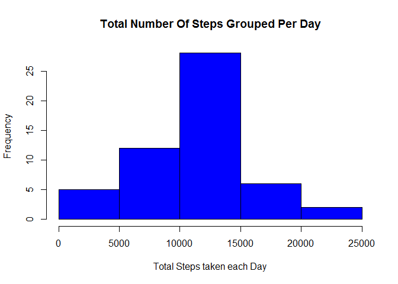
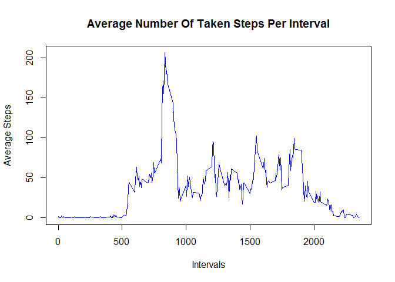
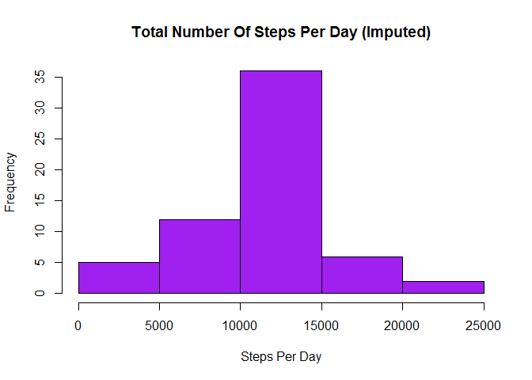
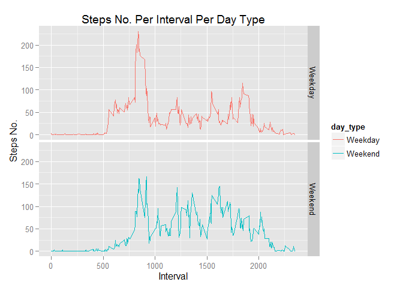

# Reproducible Research: Peer Assessment 1


## Loading and preprocessing the data


```r
library("dplyr")
```

```
## 
## Attaching package: 'dplyr'
## 
## The following objects are masked from 'package:stats':
## 
##     filter, lag
## 
## The following objects are masked from 'package:base':
## 
##     intersect, setdiff, setequal, union
```

```r
library("knitr")
```

```
## Warning: package 'knitr' was built under R version 3.2.3
```

```r
library("ggplot2")

opts_chunk$set(echo = TRUE)

setwd("C:/Users/Administrator/Desktop/RepData_PeerAssessment1")

RawData <- read.csv('activity.csv')

CompletData <- RawData[complete.cases(RawData), ]
```


## What is mean total number of steps taken per day?


```r
GroupedPerDay <- group_by(CompletData, date)

StepsPerDay <- summarise(GroupedPerDay, total = sum(steps))

hist(StepsPerDay$total, main="Total Number Of Steps Grouped Per Day", xlab="Total Steps taken each Day", col="blue")
```

 

```r
MeanValue <- round(mean(StepsPerDay$total))

MedianValue <- median(StepsPerDay$total)

print(MeanValue)
```

```
## [1] 10766
```

```r
print(MedianValue)
```

```
## [1] 10765
```

## What is the average daily activity pattern?


```r
AvgStepsPerInterval <- aggregate(steps ~ interval, CompletData, mean)

plot(AvgStepsPerInterval$interval, AvgStepsPerInterval$steps, type='l', col=4, main="Average Number Of Taken Steps Per Interval", xlab="Intervals", ylab="Average Steps")
```

 

```r
IntervalIndex <- which.max(AvgStepsPerInterval$steps)

print (paste("The Interval With The Highest Average Steps is: ", AvgStepsPerInterval[IntervalIndex, ]$interval, 
             ". While The Number Of Steps For That Interval is: ", round(AvgStepsPerInterval[IntervalIndex, ]$steps, digits = 1)))
```

```
## [1] "The Interval With The Highest Average Steps is:  835 . While The Number Of Steps For That Interval is:  206.2"
```


## Imputing missing values


```r
TotMissingValue <- RawData[!complete.cases(RawData), ]

nrow(TotMissingValue)
```

```
## [1] 2304
```

```r
for (i in 1:nrow(RawData)) 
  
  {
  
  if(is.na(RawData$steps[i])) 
    
    {
    
    val <- AvgStepsPerInterval$steps[which(AvgStepsPerInterval$interval == RawData$interval[i])]
    
    RawData$steps[i] <- val 
  }
}

ImputeStepsPerDay <- aggregate(steps ~ date, RawData, sum)

hist(ImputeStepsPerDay$steps, main = "Total Number Of Steps Per Day (Imputed)", xlab = "Steps Per Day", col = "purple")
```

 

```r
print(round(mean(ImputeStepsPerDay$steps)))
```

```
## [1] 10766
```

```r
print(round(median(ImputeStepsPerDay$steps)))
```

```
## [1] 10766
```
#### The imputed values don't have impact on on the estimates of the total daily number of steps.


## Are there differences in activity patterns between weekdays and weekends?


```r
week_day <- function(date_val) {
  wd <- weekdays(as.Date(date_val, '%Y-%m-%d'))
  if  (!(wd == 'Saturday' || wd == 'Sunday')) {
    x <- 'Weekday'
  } else {
    x <- 'Weekend'
  }
  x
}

RawData$day_type <- as.factor(sapply(RawData$date, week_day))

ImputeStepsPerDay <- aggregate(steps ~ interval+day_type, RawData, mean)

plt <- ggplot(ImputeStepsPerDay, aes(interval, steps)) +
  geom_line(stat = "Identity", aes(colour = day_type)) +
  theme_gray() +
  facet_grid(day_type ~ ., scales="fixed", space="fixed") +
  labs(x="Interval", y=expression("Steps No.")) +
  ggtitle("Steps No. Per Interval Per Day Type")
print(plt)
```

 

#### Steps in weekends are more spread out over the time periods than their peers in weekdays.
